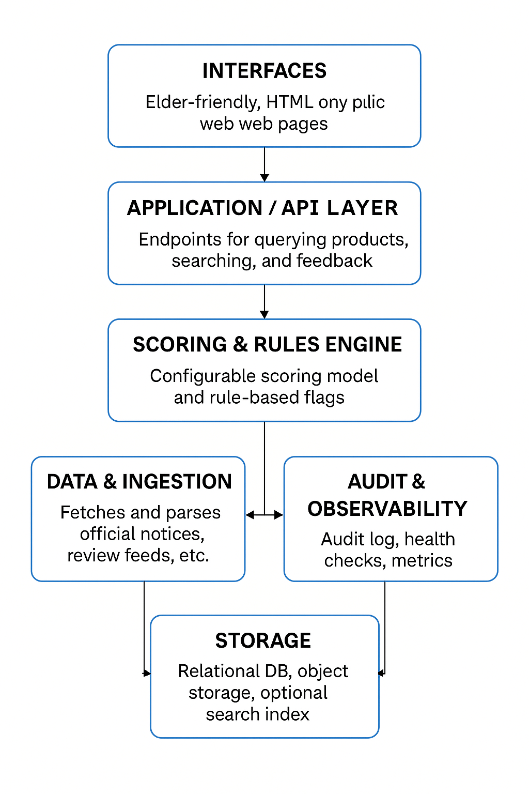

# TrustCheck — A Simple, Explainable Risk Checker for Elderly-targeted Health Products

> **Goal**: Input a product ID (or later scan/photo)→ aggregate evidence → output a transparent risk report.  
> **Context**: In China, aggressive marketing of “miracle” therapy/health products targets elderly people who may lack full information. Families struggle to judge credibility.

---

## 1) Problem & Context
- Many products are exaggerated or misleading; some are overpriced “vitamins”, others lack proper health certificates.  
- Family story: my grandparents (well educated, high pensions) still buy such products. My father asked: *“Can we quickly check if a product is credible and compliant?”*  
- Root causes (5 Whys):
1. Why did people pay the 'IQ tax'? → Lack of authoritative, aggregated product informationand warnings.​
2. Why lack of such info? → Information are across official notices, media, reviews and blogs.​
3. Why is aggregation hard? → Data formats differ, reliability varies, and commercial incentives drive biased recommendations..​
4. Why can't users search easily? → No simpletool: 'input product ID → get a report'.​
5. Why hasn’t anyone done it? → Some products, such as farm-grown herbs, are not marketable and their legal authorization is difficult to ensure. Neutral aggregation lacks commercial motivation.
---

## 2) What a Program Can (and Cannot) Solve
**Solvable by software**
- Aggregate information from multiple sources, normalize fields, and present a one-page report.  
- Compute an **explainable** risk score (transparent rules & weights).  
- Produce a shareable HTML (or mobile)  report with evidence links and audit trail.

**Not solved by software**
- Legal determination or enforcement. The tool **assists decisions**.
- Cases where official disclosure is absent: if no compliant info is publicly available, the system cannot prove compliance.  
- Very small “farm/hand-made” producers without standard barcodes or identifiers: this system may flag them as “insufficient data” even though they may be legitimate.

---

## 3) How Programming Changes the Original Process & Operating Model
**Original**: decisions based on ads/hearsay → high risk of overpaying or unsafe products.  
**With the program**:  
1. Enter product ID (or later scan/photo) →  
2. System **automatically aggregates scattered data sources** →  
3. See report →  
4. Discuss an explainable result as a family.  
**Operating-model change**: From impulse purchase to **evidence-first decision step**, reusable for each purchase.
---

## 4) Requirements on the Program
**Functional**
- Accept product ID input (future: barcode scan/photo, brand/name search).  
- Aggregate: official notices/regulatory data, consumer reviews, category/risk heuristics, price-comparison API.  
- Compute scores: Authority / Consumer / Combined + Risk flags, and optionally lowest platform price.  
- Output terminal summary and **one-page HTML** report with score breakdown & links.

**Non-functional**
- **Explainability**: breakdown of each rule, weights configurable.  
- **Traceability**: source links, timestamps.  
- **Robustness**: handle “not found” or “insufficient information” gracefully (no crash, clear message).  
- **Cross-platform**: web browser (PC/tablet/mobile), mobile app, and **WeChat mini-program** (critical in China where >1 billion users and many seniors use it).  
- **Usability**: senior-friendly UI: large fonts, high contrast, minimal clicks, plain language.
---

## 5) Usage Scenarios & Runtime Requirements
- Elderly consumers checking before purchase.  

**Runtime (demo)**: local application (Python + CSV)  
**Runtime (full design)**: small web server (or container/Cloud Function) + background data ingestion jobs; supports web browsers, mobile apps, and WeChat mini-program.  
- **Data workflow**: periodic ingestion of sources → parse/transform → store in database → query at runtime (not real-time scraping every request due to cost/latency/consistency).  
- **Infrastructure cost factors**: cloud compute (e.g., AWS EC2 or LightSail), database (RDS or equivalent), object storage for reports, background job scheduler (cron, Lambda).  
- **Commercial model**: ad-free, subscription or sponsorship; automation reduces human maintenance cost.
---

## 6) Planned Software Architecture 

**A. Interfaces (elder-friendly, HTML)**
**Interfaces (elder-friendly HTML)**  
- Home/Search: one large input box or scan button; big “Search” button; help for “No ID found?”.  
- Report Page: bold headline score, red/yellow/green indicator, breakdown of scoring, evidence links, print/PDF friendly.  
- Mobile/WeChat UI: responsive design + native mini-program possibility.

**Application/API Layer**  
- `GET /api/products/:id` → normalized product, latest scores, flags, evidence.  
- `GET /api/search?q=` → fuzzy matches for name/brand/alias.  
- `POST /api/feedback` → optional leads (volunteer/community mode).  
- Auth: public read, optional admin for ingestion/config.

**Scoring & Rules Engine**  
- Authority score: registration/cert/penalties capped.  
- Consumer score: ratings × reviewer reputation × time-decay.  
- Combined: `T = wA*A + (1−wA)*C` (configurable).  
- Price-comparison integration (optional).  
- Flags: ELDERLY_SENSITIVE, NO_AUTH_RECORD, PENALTY_HISTORY, LOW_RECENT_RATING, EVIDENCE_CONFLICT.  
- Explainability endpoint: per-rule contributions.  

**Data & Ingestion**  
- Sources: regulatory APIs, white/black lists, review feeds, price-comparison feeds.  
- Ingestion job: fetch → parse → map to canonical schema → validate → store.  
- Data storage: Demo uses CSV; full design uses relational DB + object store + optional search index.  

**Storage & Infrastructure**  
- Demo: simple CSV + Python.  
- Production: PostgreSQL/MySQL, object storage (for HTML reports), search index (for fuzzy search).  
- Audit & Observability: append-only log of scores/changes, health metrics, deterministic scoring (same input → same output).  

**Deployment**  
- Single small server or container runs API/website.  
- Nightly ingestion job updates data & recomputes scores.  
- Static reports cacheable for offline sharing (families/volunteers).  
- Future: WeChat mini-program frontend + app.
---

## 7) Ensuring Correct Functioning (quality)
- **Schema validation** on records; fail fast on missing critical fields.  
- **Unit tests** for scoring (caps, time-decay monotonicity, boundaries).  
- **test cases** (e.g., `CN-MED-0004`) to assert end-to-end outputs.  
- **Assertions**: scores in [0,100], flags from known set; 404/“insufficient info” paths tested.  
- **Auditability**: scores carry timestamp + rule contributions.

---

## 8) Usability Considerations (elder-friendly)
- Large fonts, high contrast, high contrast colors, single task per page (input → report), plain language.  
- “No ID found?” inline help, image showing barcode location; print/PDF support; keyboard and screen-reader friendly.
- Responsive design so mobile/tablet works; future WeChat mini-program for China’s smartphone seniors.  
- Report layout: **Headline decision** → **Why** → **Evidence links**.

---

## 9) How to Use

### A) demo
python app_web.py 
# Output: terminal summary + report_CN-MED-0004.html
### B) For real elderly users (final product flow)

1.Open the Home page (or WeChat mini-program/phone app).

2.Enter the Product ID from package/invoice(or tap “Scan barcode / take photo”).

3.Click Search → view Report page with bold headline score (color-coded), short explanation, and evidence links.

4.Use the Print button to save as PDF or invite family discussion.

5.If can not find ID, open “No ID found?” help; if no barcode treat as a risk signal; consider not buying or ask a trusted pharmacist/doctor.

## 10) Future Work 

- Replace CSV with official/regulatory APIs and curated databases.
- Add fuzzy search and name/brand aliasing for non-ID use.
- Integrate price-comparison API to show best available price alongside risk.
- Multilingual content (zh/EN), accessibility audits.
- fully automated ingestion & scoring, minimal manual maintenance.
- Explore commercial sustainability, sponsorship or subscription model.

## 11)Project Directory
.
├─ app_web.py                 # Web UI / API server
├─ app_logic.py               # Core logic (scoring & aggregation)
├─ templates/
│   ├─ base.html
│   ├─ index.html              # large-input web page + “No ID” help
│   └─ report.html             # one-page result report (color coded)
├─ static/
│   ├─ styles.css              # elder-friendly large fonts + high contrast + color blocks
│   └─ barcode-overview.png     # image for “where to find ID?”
├─ data/
│   ├─ products.csv
│   ├─ authorities.csv
│   └─ reviews.csv
├─ tests/                     # (future) unit + end-to-end tests
├─ docs/                      # (future) architecture diagrams etc.
├─ requirements.txt
└─ README.md

